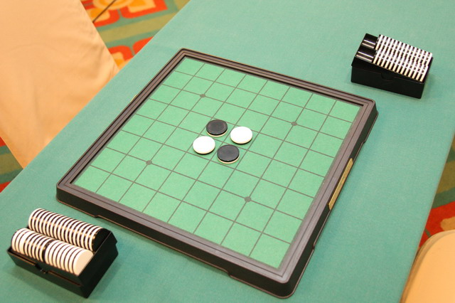
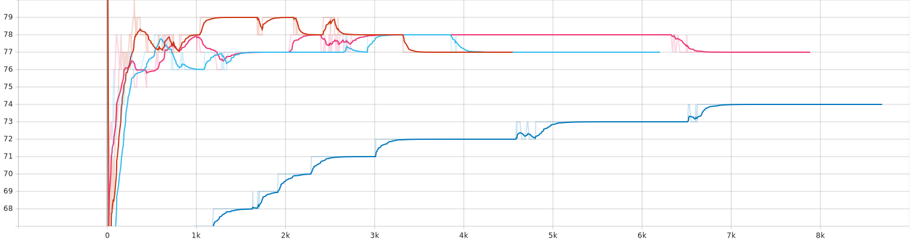

# Othello Intelligent Agent
This is my undergraduate project, in which I tried to create an intelligent agent for the `Othello` game. The main issue that is addressed is the choice complexity of players in the Othello game, which cannot be solved using classic algorithms or approaches. 
Previously, I tried to tackle the issue with the Minimax algorithm in an evolutionary manner but the results were not satisfactory.
In my new attempt, I used Reinforcement Learning and Deep Q-networks, which improved the results in terms of knowing the basic rules of the game to developing some strategies.
You can find the game logic, the agent model, and the training phase in the base code.

## Othello Game
Othello is a strategy board game for two players, played on an 8×8 uncheckered board.

### Basics
There are sixty-four identical game pieces called disks, which are light on one side and dark on the other. Players take turns placing disks on the board with their assigned colors facing up. During a play, any disks of the opponent's color that are in a straight line and bounded by the disk just placed, and another disk of the current player's color is turned over to the current player's color. The objective of the game is to have the majority of disks turned to display one's color when the last playable empty square is filled.
Check [Reference](https://en.wikipedia.org/wiki/Reversi) for more information.

## Method
To solve the choice complexity, I have used `Double DQN` (Double Deep Q-Networks), a combination of `Reinforcement Learning` and Deep Neural Networks. 
In this method, the agent sees the board as an environment and tries to improve itself using rewards(rewards can be negative which indicate bad actions) from its actions.
The reason for Double DQN is that two separate Q-Networks work together to prevent overestimation; using one of which to for estimating the actions and the other one for evaluation.

## Results
The agent wins or draws in `80%` of the games with an average score of `36`. This result is obtained after the agent played `10k games` against a random player. 
The following chart compares different parameter configuration win-draw percentages of the agent in the training phase.

## Previous Attempt
I used `Minimax` with `Alpha-Beta pruning` to create a tree of the game on the agent's turn and try to decide the best move. I've also used two heuristic functions with multiple parameters, one for the evaluation of leaves and the other one for narrowing the search tree span. I then tried to find the proper weights for functions' parameters using an evolutionary algorithm.

Because of the game complexity and high branching factor of players' choice, the Minimax tree is an inefficient way to approach such a problem. It requires a lot of memory and processing power, which cannot be achieved easily. Hence, Using this method is not applicable. The results also show the same thing because it failed to pass the given criteria. The agent created using this method was not intelligent at all.

You can read more about it [here](http://dx.doi.org/10.13140/RG.2.2.24354.91846).

## Acknowledgement
This project is conducted in Persian language and the English version is not available yet.